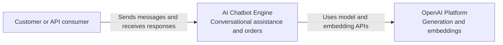
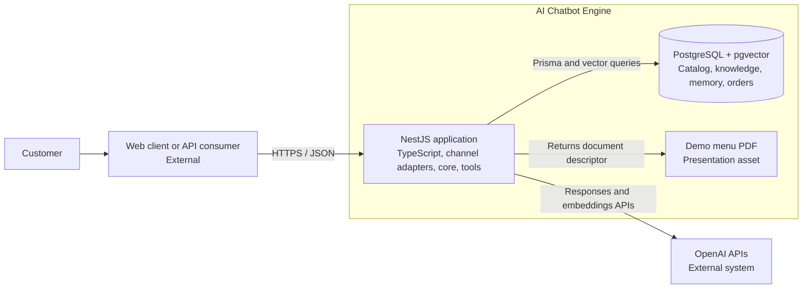
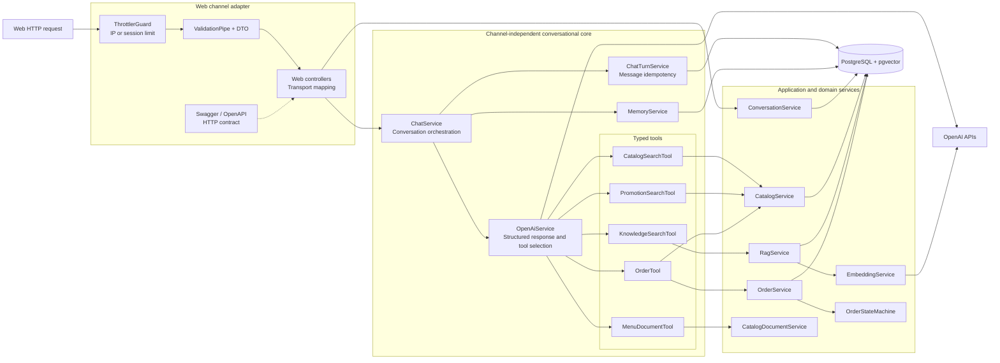
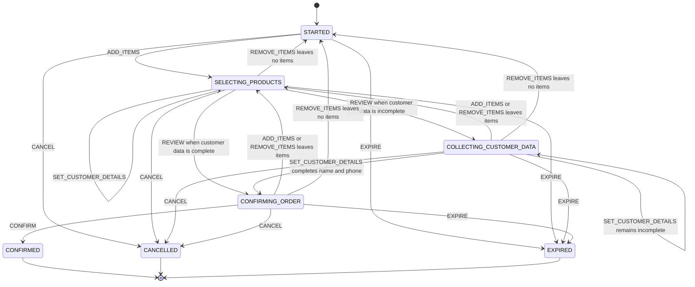
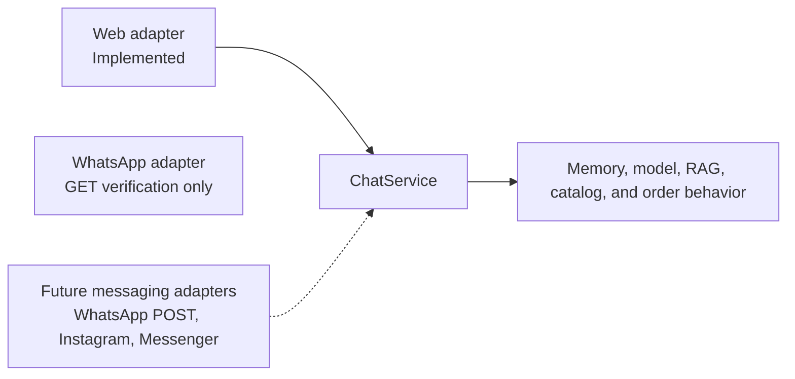

# Architecture

This document describes the current architecture of the reusable NestJS AI chatbot backend. It
focuses on the boundaries that keep conversational behavior reusable across channels and business
examples while keeping business-critical operations deterministic.

## Architectural principles

- `ChatService` is independent from HTTP, WebSocket, WhatsApp, and future channel SDKs.
- Channel modules validate transport input, resolve channel identity, and format transport output.
- Structured business data and transactional state are read from PostgreSQL, not generated by the model.
- RAG is reserved for semantic knowledge that benefits from similarity search.
- Tools bridge model intent to typed application operations.
- The order state machine has no dependency on NestJS, Prisma, OpenAI, or a channel.
- Café Nube is selected at the application composition boundary and does not leak into generic modules.

## Product boundary

The current implementation is a single-business backend demonstration with a Web HTTP chat adapter
and a verification-only WhatsApp webhook boundary. It is designed to show how an application can
combine LLM interpretation with structured catalog queries, semantic retrieval, persistent memory,
and deterministic order workflows without moving that behavior into a channel.

The following capabilities remain intentionally outside the current runtime boundary:

- Inbound or outbound WhatsApp messaging, Instagram, or Messenger integrations.
- Payment, kitchen, delivery, and real-time inventory side effects.
- Multi-tenancy, authentication, billing, and an administrative catalog API.
- Distributed rate limiting, background workers, and application deployment infrastructure.

These are extension points, not hidden assumptions. A future implementation must add them through
channel adapters, authenticated application services, transactional outbox events, and tenant-aware
data access rather than by placing more rules in prompts or controllers.

## C4 Level 1 — System context



The current customer entry point is the web HTTP adapter. WhatsApp can verify its future callback
URL through a separate GET endpoint, but it cannot yet deliver customer messages to the engine. A
future channel platform can be added without changing the relationship between the user, engine,
and model provider.

## C4 Level 2 — Containers



The NestJS application is currently deployed as one process. PostgreSQL is the durable source of
truth. The PDF is not a catalog database and is never sent to OpenAI.

## C4 Level 3 — NestJS components



Guards execute before DTO pipes in NestJS. Conversation creation is tracked by request IP; chat is
tracked by the public `sessionId`. A blocked request returns `429` before reaching conversation
persistence, the chatbot core, or OpenAI.

## Runtime request flow

1. The web rate limiter accepts or rejects the request.
2. Global DTO validation normalizes and validates the transport payload.
3. `WebChatController` resolves the public session through `ConversationService`.
4. `ChatTurnService` reserves `(conversationId, messageId)` before any model or tool execution.
5. A completed duplicate returns its stored response immediately; conflicting, processing, or
   previously failed duplicates are rejected with a channel-mapped conflict.
6. For a new turn, `ChatService` loads recent history and the current order context.
7. `OpenAiService` either answers directly or selects one typed tool.
8. Application code executes the tool and returns controlled JSON to the model.
9. OpenAI produces the customer-facing answer from the trusted tool result.
10. One PostgreSQL transaction completes the turn, stores its replay response, and appends both
    user and assistant messages to conversation memory.
11. The channel adapter returns only public reply and content fields.

Token usage, tool names, source references, latency, and correlation identifiers remain internal
telemetry and are not part of the web response contract.

## Information and tool routing

| Information or action               | Source of truth       | Runtime path                                   |
| ----------------------------------- | --------------------- | ---------------------------------------------- |
| Product names, prices, availability | PostgreSQL            | `CatalogSearchTool → CatalogService`           |
| Product preference filters          | PostgreSQL JSONB      | Typed filters generated by the model           |
| Current and scheduled promotions    | PostgreSQL            | `PromotionSearchTool → CatalogService`         |
| FAQs, location, policies, services  | PostgreSQL            | `KnowledgeSearchTool → RagService`             |
| Full menu presentation              | Repository demo asset | `MenuDocumentTool → CatalogDocumentService`    |
| Conversation history                | PostgreSQL            | `MemoryService`                                |
| Message processing and replay       | PostgreSQL            | `ChatTurnService`                              |
| Order draft and totals              | PostgreSQL            | `OrderTool → OrderService`                     |
| Customer name, phone, order no.     | PostgreSQL            | `OrderTool → OrderService`                     |
| Valid order transitions             | Domain code           | `OrderStateMachine`                            |
| Natural-language interpretation     | OpenAI                | `OpenAiService` with structured tool arguments |

The model never supplies authoritative prices, totals, order IDs, availability, or transitions.
`Product.active` controls catalog publication, while `Product.availableForOrdering` controls whether
the product may enter or confirm an order. This operational flag does not represent an exact stock
quantity and is validated again immediately before confirmation.
Promotion validity is also application-controlled: PostgreSQL filters the publication date window,
then the promotion tool evaluates recurring weekday and time rules using `BUSINESS_TIME_ZONE`.
`CURRENT` returns only promotions valid at that instant; `CATALOG` separates current promotions
from promotions scheduled for another moment.

## Order state machine



`EXPIRE` is an application lifecycle action rather than a customer-facing model action. Confirmed,
cancelled, and expired orders are terminal. Product changes after review deliberately return the
order to product selection before another review and confirmation. Customer details remain on the
draft when products change.

### Confirmation guarantees

- Order mutations take a PostgreSQL advisory transaction lock scoped to the conversation.
- The first valid `CONFIRM` transitions the active order to `CONFIRMED`.
- Confirmation is impossible until both normalized customer name and phone are persisted.
- Confirmation assigns a unique public order number from PostgreSQL; drafts have no number.
- A concurrent or repeated `CONFIRM` returns the latest confirmed order with
  `idempotentReplay=true`; it does not create or update another order.
- Adding a product after a terminal order intentionally creates a new draft.
- Product batches are validated before mutation, so a rejected multi-item change is atomic.
- Every selected product must remain active and available for ordering at confirmation time.

### Operational closure

`CONFIRMED` means that the customer accepted the reviewed order and the engine persisted its final
data and public order number. It does not mean that payment, kitchen dispatch, or delivery occurred;
those operational workflows remain outside this repository's scope.

A production extension can publish an idempotent `order.confirmed` event through a transactional
outbox for payment, point-of-sale, kitchen, or delivery systems without expanding the conversational
state machine.

### Checkout data

The current checkout requires the following identity fields before enabling final confirmation:

| Current field       | Requirement                                                                 |
| ------------------- | --------------------------------------------------------------------------- |
| Customer name       | Required and normalized before confirmation                                 |
| Customer phone      | Required, normalized to 8–15 digits, and masked before entering LLM context |
| Public order number | Assigned once by PostgreSQL only when the order becomes `CONFIRMED`         |

These fields should belong to the order domain, not conversation memory or a channel adapter. A
channel may provide trusted name and phone values to the same application operation; if either is
unavailable, the assistant requests only the missing value. The web example provides neither, so
both are collected conversationally.

A later checkout increment may add fulfillment method, conditional delivery address, and payment
method. Supported options must come from business configuration or the database rather than from
the system prompt, and raw card credentials must never be collected in chat.

Until those integrations are implemented, the chatbot must not claim that it collected an address,
charged a payment method, sent an order to a store, or arranged delivery.

## Multichannel boundary



`WhatsAppController` currently handles only Meta's callback verification handshake. It validates
the query contract, compares the private verification token, and returns the supplied challenge.
It has no dependency on `ChatService`, and it does not accept or process customer messages.

A channel adapter may:

- Validate its transport payload.
- Map an external identity to an internal conversation.
- Apply transport-specific abuse protection.
- Translate channel-neutral reply content into its native format.
- Call `ChatService`.

It must not contain prompts, retrieval rules, catalog queries, memory policies, or order logic.

## Component responsibilities

| Component                        | Owns                                                            | Must not own                               |
| -------------------------------- | --------------------------------------------------------------- | ------------------------------------------ |
| Web controllers                  | HTTP input/output and public session mapping                    | Chatbot or order rules                     |
| Swagger / OpenAPI                | Discoverable HTTP contracts and examples                        | Core or business behavior                  |
| Web rate-limit configuration     | IP/session tracking and `429` protection                        | Business limits or model behavior          |
| WhatsApp verification controller | Meta GET challenge validation                                   | Message processing or chatbot behavior     |
| `ConversationService`            | Conversation creation and public-session resolution             | Prompt or channel payload interpretation   |
| `ChatService`                    | One complete channel-neutral reply                              | HTTP, WhatsApp, or provider payloads       |
| `ChatTurnService`                | Message reservation, replay, failure state, atomic memory write | Channel-specific retry policy              |
| `OpenAiService`                  | OpenAI SDK, tools, structured output, provider errors           | Authoritative business calculations        |
| `CatalogService`                 | Exact structured business-data queries                          | Semantic retrieval or channel formatting   |
| `PromotionSearchTool`            | Current/catalog scope and time-zone-aware classification        | Natural-language date calculations         |
| `RagService`                     | Similarity search and accepted knowledge context                | Transactional catalog ownership            |
| `KnowledgeIngestionService`      | Derived vector-index synchronization                            | Source-of-truth business data              |
| `MemoryService`                  | Bounded conversation history                                    | Public session resolution                  |
| `OrderTool`                      | Structured model action to application operation                | Prices, totals, or transition decisions    |
| `OrderService`                   | Transactional order mutations and persistence                   | Natural-language interpretation            |
| `OrderStateMachine`              | Valid actions and deterministic transitions                     | Database, NestJS, model, or channel access |
| Prisma seed                      | Reproducible demo records                                       | Runtime chatbot dependency                 |

## Decisions and trade-offs

| Decision                        | Reason                                                          | Accepted cost                                       |
| ------------------------------- | --------------------------------------------------------------- | --------------------------------------------------- |
| NestJS with strict TypeScript   | Explicit modules, dependency injection, and contracts           | More structure than an Express-only application     |
| OpenAI Responses API            | Structured output and direct tool calling                       | External provider dependency                        |
| PostgreSQL with Prisma          | Typed catalog, memory, and transactional order persistence      | Requires migrations and local infrastructure        |
| pgvector for RAG                | Keeps structured and semantic data in one database              | Exact search needs indexing at larger scale         |
| Hybrid RAG and typed tools      | Uses the appropriate access pattern for each question           | More explicit routing than sending all data to LLM  |
| One tool per message            | Bounds orchestration, latency, and failure modes                | Complex requests may require another customer turn  |
| Backend-created sessions        | Rejects unknown conversations and controls lifecycle            | Requires a session-creation request                 |
| PostgreSQL message ledger       | Makes channel retries durable across restarts                   | Adds one small row per attempted message            |
| Last ten history messages       | Bounds prompt growth and cost                                   | Older context is not sent to the model              |
| PostgreSQL order drafts         | Keeps order state independent from model memory                 | Abandoned drafts need lifecycle cleanup             |
| Product price snapshots         | Preserves historical order totals                               | Duplicates selected catalog data                    |
| Confirmation closes this engine | Gives the chatbot a precise, testable success boundary          | Payment, kitchen, and delivery need later workflows |
| Boolean ordering availability   | Separates temporary availability from catalog publication       | Does not track exact stock quantities               |
| Conversation-scoped locking     | Makes order changes and confirmation replay deterministic       | PostgreSQL-specific advisory lock                   |
| In-memory web rate limiting     | Simple protection for the current single instance               | Multi-instance deployments require Redis            |
| PDF as presentation only        | Supports rich channel delivery without bloating model context   | Demo PDF must be synchronized with the catalog      |
| Live evals outside CI           | Measures real model behavior without making CI nondeterministic | Requires intentional execution and API cost         |

## Project structure

```text
src/
├── channels/web/     # Current customer transport adapter and rate limiting
├── channels/whatsapp/ # Verification-only Meta webhook boundary
├── chat/             # Conversational orchestration, OpenAI, tools, and evaluations
├── catalog/          # Structured business data and menu document
├── conversation/     # Backend-managed session lifecycle
├── memory/           # Persistent recent conversation history
├── order/            # State machine and transactional order operations
├── rag/              # Embeddings, ingestion, pgvector search, and retrieval evals
├── database/         # Prisma database integration
├── config/           # Strict environment validation
└── health/           # Health endpoint

prisma/
├── migrations/       # Committed PostgreSQL schema history
├── seed-data/        # Reproducible example records
└── schema.prisma     # Products, knowledge, conversations, and orders

examples/
├── cafe-nube/        # Replaceable business configuration and presentation asset
└── web-widget/       # Framework-free external integration example
docs/                 # Quality and evaluation documentation
```

New adapters and infrastructure are added only when implemented. Empty architectural layers are
avoided so the documented structure continues to represent executable code.
