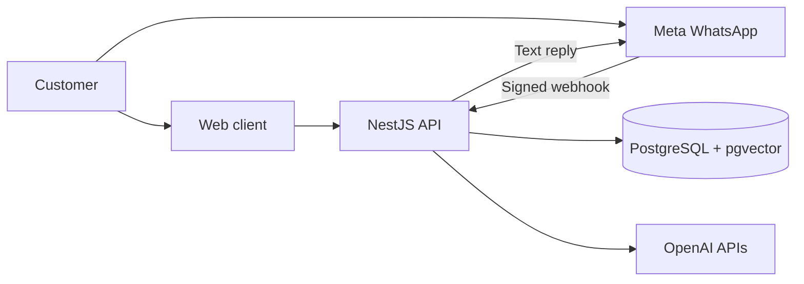

# Architecture

## Purpose and boundaries

This service is a reusable backend for one catalog and ordering business per deployment. Web HTTP and
WhatsApp are transport adapters over the same conversational core. The system combines a model for
natural-language interpretation with application-owned data and rules.

- PostgreSQL is authoritative for products, prices, promotions, conversations and orders.
- pgvector is used only for semantic business knowledge such as FAQs and policies.
- The model can select typed tools but cannot authoritatively set prices, totals, availability or
  order transitions.
- `business/` contains the deploy-specific profile and seed data. The engine does not select a
  business at runtime and is not multi-tenant.
- Payments, kitchen dispatch, delivery, real-time inventory and an administrative API are outside
  the current product boundary.

## System overview



The API is a single NestJS process. PostgreSQL holds durable application state; OpenAI provides
generation and embeddings; Meta only transports WhatsApp messages.

## Components

| Area                                  | Responsibility                                                                                                    |
| ------------------------------------- | ----------------------------------------------------------------------------------------------------------------- |
| Web channel                           | Validates HTTP input, creates public sessions, rate-limits and formats responses.                                 |
| WhatsApp channel                      | Verifies Meta signatures, deduplicates inbound messages, maps identity and sends replies through a provider port. |
| `ChatService`                         | Orchestrates one channel-neutral conversational turn.                                                             |
| `ChatTurnService` and `MemoryService` | Reserve message IDs, replay completed turns and persist bounded conversation history.                             |
| Tool registry                         | Gives the model typed access to catalog, promotions, knowledge, menu documents and orders.                        |
| Catalog and RAG                       | Serve exact structured facts and semantic knowledge respectively.                                                 |
| Orders                                | Enforce transactional changes and a deterministic state machine.                                                  |
| `business/`                           | Supplies one business profile, bootstrap catalog and presentation menu.                                           |

## Request flows

### Web chat

1. The Web adapter applies rate limits and validates the DTO.
2. It resolves the public session and reserves `(conversationId, messageId)`.
3. A completed retry returns its stored response; conflicting or processing IDs are rejected.
4. `ChatService` loads history and order context, then asks OpenAI for a direct answer or one typed
   tool call.
5. The selected tool reads or changes application-owned data.
6. A transaction stores the response and conversation memory before the adapter responds.

### WhatsApp

1. The controller verifies Meta's HMAC signature against the raw body.
2. The receipt service reserves each `(WABA ID, message.id)` in PostgreSQL; duplicates stop here.
3. The endpoint returns an empty `200` to Meta and schedules newly accepted messages in-process.
4. The adapter maps the WABA/customer pair to a stable hashed session and invokes `ChatService`.
5. `MetaWhatsAppClient` sends the reply; outbound status updates advance a persisted WAMID lifecycle
   monotonically (`ACCEPTED` through `READ` or `FAILED`).

The early `200` keeps the webhook responsive but is best-effort: a process crash after acknowledgement
can lose work. A durable queue and worker are required before running this flow as a resilient,
multi-instance service.

## Information routing

| Request type                    | Source of truth                | Path                                 |
| ------------------------------- | ------------------------------ | ------------------------------------ |
| Product, price, availability    | PostgreSQL                     | Catalog tool → `CatalogService`      |
| Promotion validity              | PostgreSQL + business timezone | Promotion tool → `CatalogService`    |
| FAQ, policy, location           | pgvector                       | Knowledge tool → `RagService`        |
| Menu presentation               | Repository asset               | Menu tool → `CatalogDocumentService` |
| Conversation history            | PostgreSQL                     | `MemoryService`                      |
| Order draft and totals          | PostgreSQL                     | Order tools → `OrderService`         |
| Natural-language interpretation | OpenAI                         | `OpenAiService` and typed tools      |

## Order lifecycle

```mermaid
stateDiagram-v2
    [*] --> STARTED
    STARTED --> SELECTING_PRODUCTS: add items
    SELECTING_PRODUCTS --> SELECTING_PRODUCTS: add or remove
    SELECTING_PRODUCTS --> COLLECTING_CUSTOMER_DATA: review; identity missing
    SELECTING_PRODUCTS --> CONFIRMING_ORDER: review; identity complete
    COLLECTING_CUSTOMER_DATA --> CONFIRMING_ORDER: set complete identity
    CONFIRMING_ORDER --> CONFIRMED: confirm
    STARTED --> CANCELLED: cancel
    SELECTING_PRODUCTS --> CANCELLED: cancel
    COLLECTING_CUSTOMER_DATA --> CANCELLED: cancel
    CONFIRMING_ORDER --> CANCELLED: cancel
    STARTED --> EXPIRED: expire
    SELECTING_PRODUCTS --> EXPIRED: expire
    COLLECTING_CUSTOMER_DATA --> EXPIRED: expire
    CONFIRMING_ORDER --> EXPIRED: expire
```



Order mutations take a conversation-scoped PostgreSQL lock. Product batches are validated atomically,
prices are snapshotted, and confirmation requires a reviewed order plus normalized customer name and
phone. The first confirmation assigns a public order number; repeated confirmation returns the same
confirmed order. `CONFIRMED` records customer acceptance only—it does not trigger payment, kitchen or
delivery operations.

## Design decisions

| Decision                        | Why                                                                             | Trade-off                                                  |
| ------------------------------- | ------------------------------------------------------------------------------- | ---------------------------------------------------------- |
| Hybrid RAG and typed tools      | Semantic questions and transactional facts need different retrieval paths.      | Explicit tool routing.                                     |
| One tool per turn               | Bounds latency and orchestration failures.                                      | Complex requests can take another turn.                    |
| PostgreSQL message ledger       | Makes retries and duplicate suppression durable.                                | Storage per attempted message.                             |
| Hashed WhatsApp session ID      | Preserves conversational continuity without exposing a raw phone as session ID. | Deterministic WABA/customer mapping.                       |
| Provider port for WhatsApp      | Keeps Meta HTTP details out of the conversational core.                         | Additional interface and adapter.                          |
| Price snapshots and order locks | Preserves historical totals and deterministic confirmation.                     | PostgreSQL-specific locking.                               |
| In-memory Web rate limits       | Simple guard for one application instance.                                      | Distributed deployments need shared storage such as Redis. |
| Live AI evaluations outside CI  | Measures model behavior without nondeterministic CI or incidental cost.         | Must be run deliberately.                                  |

## Repository map

```text
src/channels/     Web and WhatsApp adapters
src/chat/         Turn orchestration, OpenAI integration and tools
src/catalog/      Structured catalog and menu document
src/conversation/ Public session lifecycle
src/memory/       Persistent conversation history
src/order/        State machine and transactional order operations
src/rag/          Embeddings, ingestion and pgvector retrieval
src/database/     Prisma integration
src/config/       Environment and business configuration
business/         Profile, seed data and menu asset for one deployment
```
