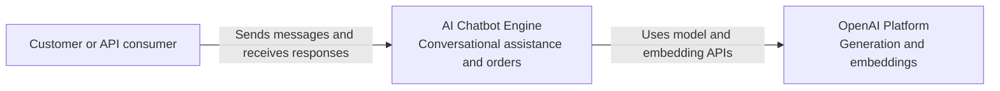
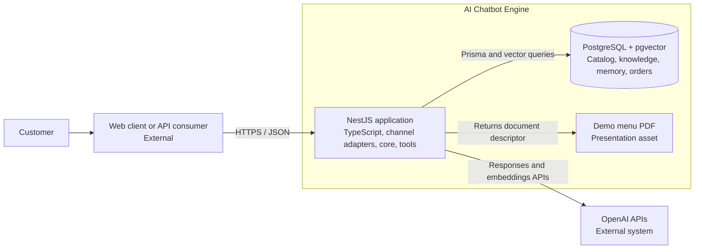
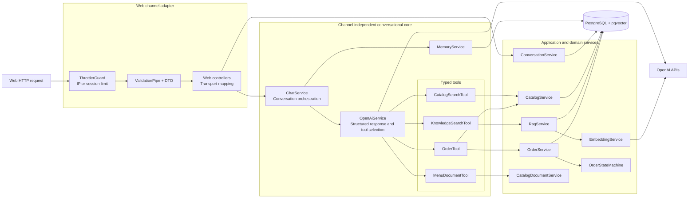
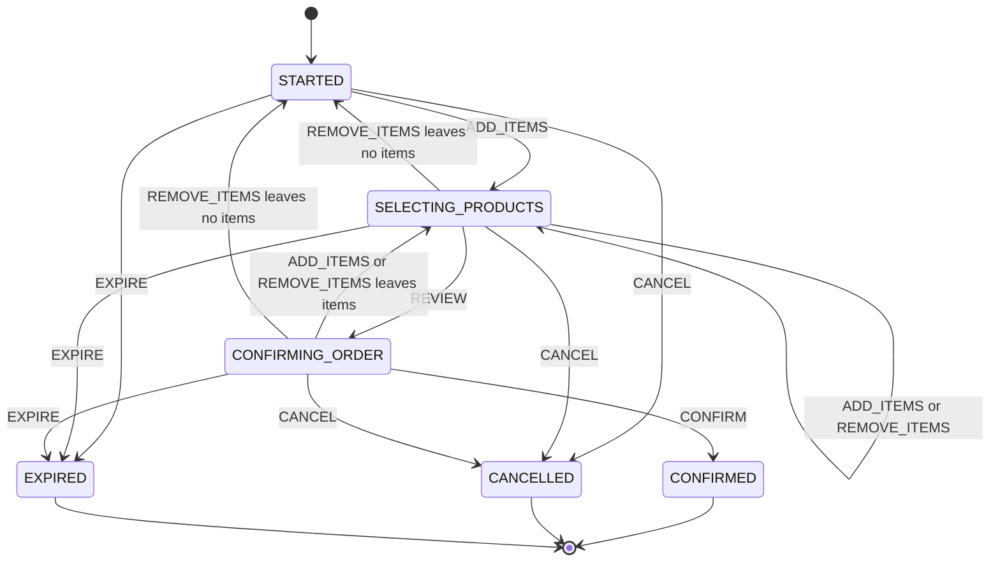
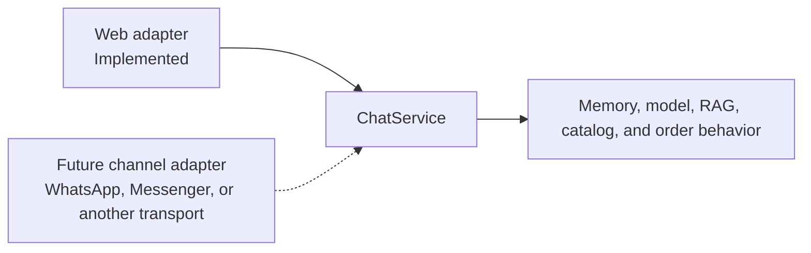

# Architecture

This document describes the current architecture of the chatbot engine. It focuses on the
boundaries that keep conversational behavior reusable across channels and business examples.

## Architectural principles

- `ChatService` is independent from HTTP, WebSocket, WhatsApp, and future channel SDKs.
- Channel modules validate transport input, resolve channel identity, and format transport output.
- Structured business data and transactional state are read from PostgreSQL, not generated by the model.
- RAG is reserved for semantic knowledge that benefits from similarity search.
- Tools bridge model intent to typed application operations.
- The order state machine has no dependency on NestJS, Prisma, OpenAI, or a channel.
- Café Nube is selected at the application composition boundary and does not leak into generic modules.

## C4 Level 1 — System context



The current external entry point is the web HTTP adapter. A future channel platform can be added
as another adapter without changing the relationship between the user, engine, and model provider.

## C4 Level 2 — Containers



The NestJS application is currently deployed as one process. PostgreSQL is the durable source of
truth. The PDF is not a catalog database and is never sent to OpenAI.

## C4 Level 3 — NestJS components



Guards execute before DTO pipes in NestJS. Conversation creation is tracked by request IP; chat is
tracked by the public `sessionId`. A blocked request returns `429` before reaching conversation
persistence, the chatbot core, or OpenAI.

## Runtime request flow

1. The web rate limiter accepts or rejects the request.
2. Global DTO validation normalizes and validates the transport payload.
3. `WebChatController` resolves the public session through `ConversationService`.
4. `ChatService` loads recent history and the current order context.
5. `OpenAiService` either answers directly or selects one typed tool.
6. Application code executes the tool and returns controlled JSON to the model.
7. OpenAI produces the customer-facing answer from the trusted tool result.
8. `MemoryService` saves the completed user and assistant exchange.
9. The channel adapter returns only public reply and content fields.

Token usage, tool names, source references, latency, and correlation identifiers remain internal
telemetry and are not part of the web response contract.

## Information and tool routing

| Information or action           | Source of truth       | Runtime path                                   |
| ------------------------------- | --------------------- | ---------------------------------------------- |
| Product names and prices        | PostgreSQL            | `CatalogSearchTool → CatalogService`           |
| Product preference filters      | PostgreSQL JSONB      | Typed filters generated by the model           |
| Promotions and FAQs             | PostgreSQL            | `KnowledgeSearchTool → RagService`             |
| Location, policies, services    | PostgreSQL            | Semantic pgvector retrieval                    |
| Full menu presentation          | Repository demo asset | `MenuDocumentTool → CatalogDocumentService`    |
| Conversation history            | PostgreSQL            | `MemoryService`                                |
| Order draft and totals          | PostgreSQL            | `OrderTool → OrderService`                     |
| Valid order transitions         | Domain code           | `OrderStateMachine`                            |
| Natural-language interpretation | OpenAI                | `OpenAiService` with structured tool arguments |

The model never supplies authoritative prices, totals, order IDs, availability, or transitions.
Catalog tools do not claim real-time stock unless a future inventory source explicitly provides it.

## Order state machine



`EXPIRE` is an application lifecycle action rather than a customer-facing model action. Confirmed,
cancelled, and expired orders are terminal. Product changes after review deliberately return the
order to product selection before another review and confirmation.

## Multichannel boundary



A channel adapter may:

- Validate its transport payload.
- Map an external identity to an internal conversation.
- Apply transport-specific abuse protection.
- Translate channel-neutral reply content into its native format.
- Call `ChatService`.

It must not contain prompts, retrieval rules, catalog queries, memory policies, or order logic.

## Component responsibilities

| Component                    | Owns                                                  | Must not own                               |
| ---------------------------- | ----------------------------------------------------- | ------------------------------------------ |
| Web controllers              | HTTP input/output and public session mapping          | Chatbot or order rules                     |
| Web rate-limit configuration | IP/session tracking and `429` protection              | Business limits or model behavior          |
| `ConversationService`        | Conversation creation and public-session resolution   | Prompt or channel payload interpretation   |
| `ChatService`                | One complete channel-neutral reply                    | HTTP, WhatsApp, or provider payloads       |
| `OpenAiService`              | OpenAI SDK, tools, structured output, provider errors | Authoritative business calculations        |
| `CatalogService`             | Exact structured business-data queries                | Semantic retrieval or channel formatting   |
| `RagService`                 | Similarity search and accepted knowledge context      | Transactional catalog ownership            |
| `KnowledgeIngestionService`  | Derived vector-index synchronization                  | Source-of-truth business data              |
| `MemoryService`              | Bounded conversation history                          | Public session resolution                  |
| `OrderTool`                  | Structured model action to application operation      | Prices, totals, or transition decisions    |
| `OrderService`               | Transactional order mutations and persistence         | Natural-language interpretation            |
| `OrderStateMachine`          | Valid actions and deterministic transitions           | Database, NestJS, model, or channel access |
| Prisma seed                  | Reproducible demo records                             | Runtime chatbot dependency                 |

## Decisions and trade-offs

| Decision                      | Reason                                                          | Accepted cost                                      |
| ----------------------------- | --------------------------------------------------------------- | -------------------------------------------------- |
| NestJS with strict TypeScript | Explicit modules, dependency injection, and contracts           | More structure than an Express-only application    |
| OpenAI Responses API          | Structured output and direct tool calling                       | External provider dependency                       |
| PostgreSQL with Prisma        | Typed catalog, memory, and transactional order persistence      | Requires migrations and local infrastructure       |
| pgvector for RAG              | Keeps structured and semantic data in one database              | Exact search needs indexing at larger scale        |
| Hybrid RAG and typed tools    | Uses the appropriate access pattern for each question           | More explicit routing than sending all data to LLM |
| One tool per message          | Bounds orchestration, latency, and failure modes                | Complex requests may require another customer turn |
| Backend-created sessions      | Rejects unknown conversations and controls lifecycle            | Requires a session-creation request                |
| Last ten history messages     | Bounds prompt growth and cost                                   | Older context is not sent to the model             |
| PostgreSQL order drafts       | Keeps order state independent from model memory                 | Abandoned drafts need lifecycle cleanup            |
| Product price snapshots       | Preserves historical order totals                               | Duplicates selected catalog data                   |
| In-memory web rate limiting   | Simple protection for the current single instance               | Multi-instance deployments require Redis           |
| PDF as presentation only      | Supports rich channel delivery without bloating model context   | Demo PDF must be synchronized with the catalog     |
| Live evals outside CI         | Measures real model behavior without making CI nondeterministic | Requires intentional execution and API cost        |

## Project structure

```text
src/
├── channels/web/     # Current transport adapter and rate limiting
├── chat/             # Conversational orchestration, OpenAI, tools, and evaluations
├── catalog/          # Structured business data and menu document
├── conversation/     # Backend-managed session lifecycle
├── memory/           # Persistent recent conversation history
├── order/            # State machine and transactional order operations
├── rag/              # Embeddings, ingestion, pgvector search, and retrieval evals
├── database/         # Prisma database integration
├── config/           # Strict environment validation
└── health/           # Health endpoint

prisma/
├── migrations/       # Committed PostgreSQL schema history
├── seed-data/        # Reproducible example records
└── schema.prisma     # Products, knowledge, conversations, and orders

examples/cafe-nube/   # Replaceable business configuration and presentation asset
docs/                 # Quality and evaluation documentation
```

New adapters and infrastructure are added only when implemented. Empty architectural layers are
avoided so the documented structure continues to represent executable code.
