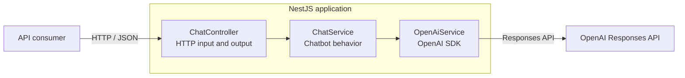

# Architecture

This document describes the current structure and the boundaries that allow the chatbot engine
to support multiple channels without duplicating conversational logic.

## System design

The current request path is:

```text
HTTP request → DTO validation → ChatController → ChatService → OpenAiService → OpenAI
```



The application is currently stateless. Each request is independent and no database, cache, or
conversation history is used yet.

## Multichannel boundary

Channels must remain adapters around the conversational core:

```text
Web adapter ─────┐
                 ├──→ ChatService
WhatsApp adapter ┘
```

A channel may validate its payload, normalize the incoming message, and format the outgoing
response. It must not contain prompts, knowledge retrieval, memory rules, or order logic.

## Component responsibilities

| Component | Responsibility | Must not |
| --- | --- | --- |
| `controller` | Handle transport input and output | Contain chatbot rules |
| `DTO` | Validate the transport contract | Contain business logic |
| `ChatService` | Define chatbot behavior and coordinate a reply | Depend on HTTP or a messaging channel |
| `OpenAiService` | Encapsulate the OpenAI SDK and provider errors | Handle channel payloads |
| `ConfigModule` | Load and validate environment variables | Expose secrets in logs or responses |

## Decisions and trade-offs

| Decision | Reason | Accepted cost |
| --- | --- | --- |
| NestJS + strict TypeScript | Provides modules, dependency injection, and explicit contracts | More framework structure than Express |
| OpenAI Responses API | Current API for model responses and future tool use | Creates an external provider dependency |
| `gpt-5.6-luna` | Fits a cost-sensitive conversational workload | Harder requests may require a stronger model |
| HTTP endpoint first | Validates the core with minimal transport complexity | WebSocket streaming is not available yet |
| No persistence yet | Keeps the first vertical slice easy to understand and test | Requests have no conversation memory |
| Mocked OpenAI in unit tests | Tests remain fast and do not consume API credits | Provider integration still needs a real smoke test |

## Project structure

```text
src/
├── chat/
│   ├── dto/
│   │   └── chat-message.dto.ts
│   ├── chat.controller.ts
│   ├── chat.module.ts
│   ├── chat.service.ts
│   ├── chat.service.spec.ts
│   └── openai.service.ts
├── config/
│   ├── environment.ts
│   └── environment.spec.ts
├── health/
├── app.module.ts
└── main.ts
```

New channel, persistence, retrieval, and order modules will be added only when their
functionality is implemented. Empty architectural layers are intentionally avoided.
