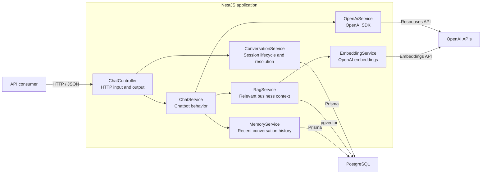

# Architecture

This document describes the current structure and the boundaries that allow the chatbot engine
to support multiple channels without duplicating conversational logic.

## System design

The current request path is:

```text
HTTP request → DTO validation → ChatController
                                   ├→ ConversationService → PostgreSQL
                                   └→ ChatService
                                       ├→ RagService
                                       │   ├→ EmbeddingService → OpenAI
                                       │   └→ PostgreSQL + pgvector
                                       ├→ MemoryService → PostgreSQL
                                       └→ OpenAiService → OpenAI
```



The web adapter resolves a backend-created public session ID through `ConversationService` before
calling `ChatService` with the internal conversation ID. `MemoryService` loads the latest 10
messages and stores completed user/assistant exchanges using that internal ID. `RagService`
embeds each query and retrieves up to five knowledge chunks above the configured similarity
threshold instead of sending the complete catalog to the generation model. Retrieved source IDs,
types, and scores are logged for observability without exposing them through the channel response.

## Multichannel boundary

Channels must remain adapters around the conversational core:

```text
Web adapter ─────┐
                 ├──→ ChatService
WhatsApp adapter ┘
```

A channel may validate its payload, normalize the incoming message, and format the outgoing
response. It must not contain prompts, knowledge retrieval, memory rules, or order logic.

## Component responsibilities

| Component                   | Responsibility                                    | Must not                              |
| --------------------------- | ------------------------------------------------- | ------------------------------------- |
| `controller`                | Handle transport input and output                 | Contain chatbot rules                 |
| `DTO`                       | Validate the transport contract                   | Contain business logic                |
| `ConversationService`       | Create and resolve backend-managed conversations  | Contain prompts or channel payloads   |
| `ChatService`               | Define chatbot behavior and coordinate a reply    | Depend on HTTP or a messaging channel |
| `OpenAiService`             | Encapsulate the OpenAI SDK and provider errors    | Handle channel payloads               |
| `ConfigModule`              | Load and validate environment variables           | Expose secrets in logs or responses   |
| `DatabaseModule`            | Provide one shared Prisma database client         | Contain catalog or chatbot rules      |
| `CatalogService`            | Read structured business data through Prisma      | Depend on HTTP or a messaging channel |
| `EmbeddingService`          | Generate fixed-size vectors through OpenAI        | Build prompts or handle channels      |
| `RagService`                | Retrieve relevant knowledge through pgvector      | Own structured catalog data           |
| `KnowledgeIngestionService` | Build the derived vector index from active data   | Become the source of truth            |
| `MemoryService`             | Load and save history by internal conversation ID | Resolve public sessions or channels   |
| Prisma seed                 | Load reproducible public demonstration data       | Become a runtime dependency           |

## Decisions and trade-offs

| Decision                        | Reason                                                         | Accepted cost                                       |
| ------------------------------- | -------------------------------------------------------------- | --------------------------------------------------- |
| NestJS + strict TypeScript      | Provides modules, dependency injection, and explicit contracts | More framework structure than Express               |
| OpenAI Responses API            | Current API for model responses and future tool use            | Creates an external provider dependency             |
| `gpt-5.6-luna`                  | Fits a cost-sensitive conversational workload                  | Harder requests may require a stronger model        |
| HTTP endpoint first             | Validates the core with minimal transport complexity           | WebSocket streaming is not available yet            |
| PostgreSQL + Prisma             | Keeps catalog data structured, queryable, and type-safe        | Requires a local database and migrations            |
| Demo seed in the repository     | Makes the project reproducible for reviewers and contributors  | Demo content must stay separate from engine logic   |
| OpenAI `text-embedding-3-small` | Reuses the existing provider and SDK                           | Adds one small embedding request per search         |
| Exact pgvector search           | Is simple and accurate for the current 24 chunks               | Needs a vector index when the dataset becomes large |
| Five retrieved chunks           | Reduces generation input while keeping useful context          | Exhaustive lists need aggregate catalog chunks      |
| PostgreSQL conversation history | Reuses existing infrastructure and persists sessions           | Adds database reads and writes per chat request     |
| Backend-created web sessions    | Gives the platform control over valid conversations            | Requires a session-creation request before chat     |
| Last 10 messages as context     | Bounds the initial memory implementation                       | Older messages are not sent to the model            |
| Application-managed history     | Keeps memory independent from the model provider               | Does not preserve provider-specific reasoning items |
| Mocked OpenAI in unit tests     | Tests remain fast and do not consume API credits               | Provider integration still needs a real smoke test  |

## Project structure

```text
src/
├── catalog/
│   ├── catalog.controller.ts
│   ├── catalog.module.ts
│   └── catalog.service.ts
├── chat/
│   ├── dto/
│   │   └── chat-message.dto.ts
│   ├── chat.controller.ts
│   ├── chat.module.ts
│   ├── chat.service.ts
│   ├── chat.service.spec.ts
│   └── openai.service.ts
├── config/
│   ├── environment.ts
│   └── environment.spec.ts
├── conversation/
│   ├── conversation.controller.ts
│   ├── conversation.module.ts
│   ├── conversation.service.ts
│   ├── conversation.service.spec.ts
│   └── conversation.types.ts
├── database/
│   ├── database.module.ts
│   └── prisma.service.ts
├── health/
├── memory/
│   ├── memory.module.ts
│   ├── memory.service.ts
│   ├── memory.service.spec.ts
│   └── memory.types.ts
├── rag/
│   ├── embedding.service.ts
│   ├── ingest-knowledge.ts
│   ├── knowledge-document.factory.ts
│   ├── knowledge-ingestion.service.ts
│   ├── rag.module.ts
│   ├── rag.service.ts
│   └── rag.types.ts
├── app.module.ts
└── main.ts

prisma/
├── migrations/
├── seed-data/
│   └── cafe-nube.ts
├── schema.prisma
└── seed.ts
```

New channel, retrieval, and order modules will be added only when their functionality is
implemented. Empty architectural layers are intentionally avoided.
