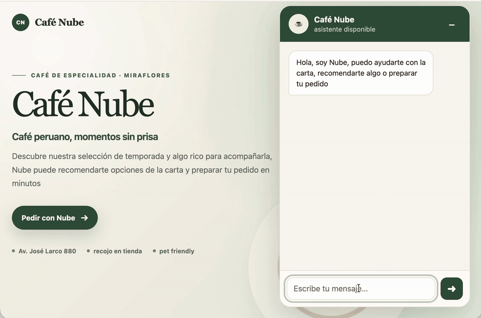

# Reusable NestJS AI Chatbot Backend

[](https://github.com/juanjosechiroque/nestjs-multichannel-ai-chatbot-engine/actions/workflows/ci.yml)
[](LICENSE)

Reusable backend for catalog and ordering businesses. It combines OpenAI tool calling, pgvector RAG,
structured catalog data, persistent memory and deterministic orders. Web HTTP and WhatsApp Cloud API
adapters share the same conversational core.



## What it does

- Searches products, promotions and business knowledge through the appropriate source: PostgreSQL for
  structured data and pgvector for semantic queries.
- Persists conversations and handles message retries idempotently.
- Manages orders with application-controlled prices, totals, availability and transitions.
- Exposes a documented Web API and, optionally, a Meta-signed WhatsApp webhook.
- Keeps business identity and catalog data in [`business/`](business/README.md), separate from the
  engine.

OpenAI interprets language and selects typed tools. PostgreSQL owns business facts, orders and
memory; the model does not determine prices, totals or state transitions.

## Scope

One deployment serves one business and database; this is not a multi-tenant SaaS. The current domain
supports configurable catalog and ordering. It does not include payments, kitchen or delivery operations,
real-time inventory, user authentication or an administrative panel.

WhatsApp processes an accepted message in the background after returning `200` to Meta. It is a
single-process integration: a restart between acknowledgement and processing can lose a message.
There is not yet a durable queue or recovery worker.

## Quick start

Requirements: Node.js 24+, npm, Docker/Compose and an `OPENAI_API_KEY`. Meta credentials are only
needed for WhatsApp.

```bash
git clone https://github.com/juanjosechiroque/nestjs-multichannel-ai-chatbot-engine.git
cd nestjs-multichannel-ai-chatbot-engine
npm install
cp .env.example .env

npm run db:start
npm run db:generate
npm run db:migrate
npm run db:seed
npm run knowledge:ingest
npm run start:dev
```

The API is available at `http://localhost:3000/api`; Swagger is at `/api/docs`.

### Run modes

Web-only mode is the default:

```bash
WHATSAPP_ENABLED=false
```

To enable WhatsApp, configure valid values for `WHATSAPP_VERIFY_TOKEN`, `WHATSAPP_APP_SECRET` and
`WHATSAPP_ACCESS_TOKEN`, then use:

```bash
WHATSAPP_ENABLED=true
```

The WhatsApp module is not registered when disabled. See [`.env.example`](.env.example) for every
supported setting.

## API

| Endpoint                                             | Purpose                                                      |
| ---------------------------------------------------- | ------------------------------------------------------------ |
| `GET /api/health/live`                               | Process liveness (`/api/health` is an alias).                |
| `GET /api/health/ready`                              | NestJS and PostgreSQL readiness.                             |
| `POST /api/conversations`                            | Creates a public session.                                    |
| `POST /api/chat`                                     | Sends a chat turn.                                           |
| `GET /api/products`, `/promotions`, `/faqs`, `/menu` | Reads catalog, knowledge and menu data.                      |
| `GET` / `POST /api/webhook/whatsapp`                 | WhatsApp verification and receipt when that mode is enabled. |

To chat, first create a conversation and retain the returned `sessionId`:

```bash
curl -X POST http://localhost:3000/api/conversations

curl -X POST http://localhost:3000/api/chat \
  -H 'Content-Type: application/json' \
  -d '{"sessionId":"<uuid>","messageId":"<uuid-v4>","message":"¿Qué bebidas calientes tienen?"}'
```

Each new message requires a UUID v4 `messageId`. A retry must reuse the same identifier and text; it
returns the stored response without repeating model calls or order mutations.

## Configure a business

The bundled example is Café Nube. For another catalog and ordering business, update `business/profile.json`,
`business/seed.ts` and `business/assets/menu.pdf`, then run:

```bash
npm run db:seed
npm run knowledge:ingest
```

[`business/README.md`](business/README.md) describes those files. The PDF is a presentation asset;
catalog, prices and orders always come from PostgreSQL.

Categories and product attributes are business data: `business/seed.ts` defines category slugs, labels,
search terms, and a validated attribute schema. The core is configurable for this catalog-and-ordering
boundary; it does not claim to support every industry.

## Commands

| Command                          | Purpose                                                      |
| -------------------------------- | ------------------------------------------------------------ |
| `npm run validate`               | Lint, formatting, types, unit tests with coverage and build. |
| `npm run test:integration`       | Integration against disposable PostgreSQL/pgvector.          |
| `npm run test:e2e`               | HTTP flows with disposable infrastructure.                   |
| `npm run rag:evaluate`           | Semantic retrieval using configured models.                  |
| `npm run chat:evaluate:catalog`  | Catalog tool selection.                                      |
| `npm run chat:evaluate:security` | Injection and unsupported-claim handling.                    |
| `npm run chat:evaluate:orders`   | Multi-turn order conversations.                              |

Live evaluations use credentials and can incur cost. The full strategy is in
[Quality and evaluations](docs/QUALITY.md).

## Documentation

- [Architecture](ARCHITECTURE.md): boundaries, components, flows and design decisions.
- [Quality and evaluations](docs/QUALITY.md): what each suite verifies and when to run it.
- [Business configuration](business/README.md): how to change the example business.
- [Web widget example](examples/web-widget/README.md): framework-free Web integration.
- [Privacy note](PRIVACY.md): data handling for the WhatsApp demo.

## License

[MIT](LICENSE)
